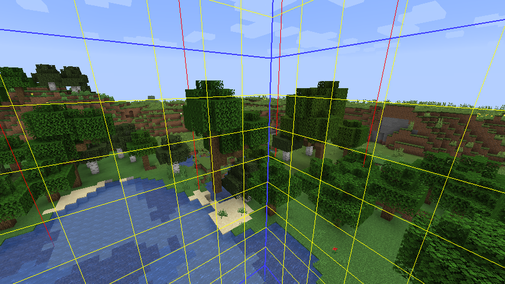
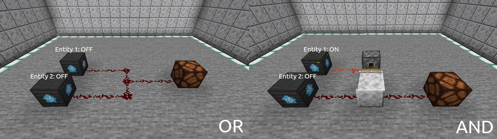
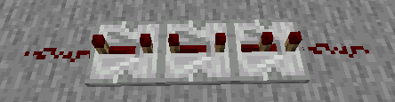

# Building automations

Combined with redstone mechanics such as repeaters and pistons, it is possible to build and execute automations entirely within Minecraft.

## Keeping chunks loaded

Before we can embark on building automations, we need to ensure that our automations will be able to run all the time, even without player presence. 

### What are Minecraft chunks?

A Minecraft chunk is a 256 tall, 16 by 16 segment of a world. They are used by the world generator to divide maps into managable pieces. In Minecraft, chunks are unloaded when players are either far away or are not present in the world. Game mechanics will stop, including command blocks, mob spawning and redstone mechanics. The `/forceload` command can help us to ensure selected chunks are constantly loaded.

### How to forceload a chunk

Stand over a selected chunk and run the command `/forceload add ~ ~`. To easily identify the borders of chunks, hit `F3 + G` to enable debug mode. Chunks that have been forceloaded will now stay loaded persistently, allowing us to build our automations and have them run all the time.

## Simple automation

This example demonstrates how to build an automation which **Turns on the ceiling light `light.ceiling_light` when a seat is occupied `binary_sensor.seat_sensor`** and vice versa (turns off).

<video width="100%" controls>
  <source src="./assets/videos/automation_example01.mp4" type="video/mp4">
  Your browser does not support the video tag.
</video> 

Note the seat sensor `binary_sensor.seat_sensor` state is set to `off` when someone is seated.

## Logic gates

HomeAssistantMC allows you to create flow based automations similar to Node Red. Examples of logic gates are below.

## Setting delays

To build delays, we can use redstone repeaters. To create a 1 second delay with repeaters, we need 10 ticks, so use 2 on full delay (8 redstone ticks) and 1 set halfway (2 redstone ticks).

