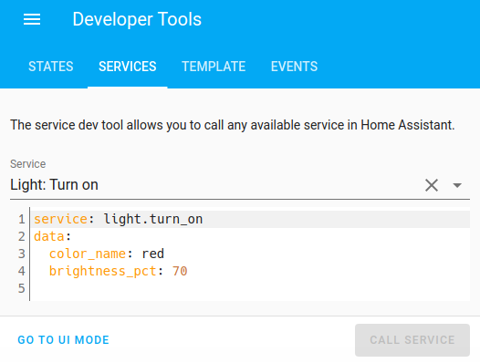
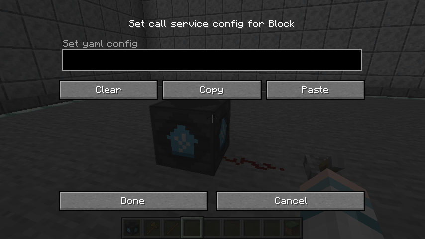

# Service Block

The service block is an input redstone block. When the block is powered by a redstone source, it will call a home assistant service along with the specified configuration.

### Examples

- Turn on the light bulb at 40% brightness and color red.
- Play music on the smart speaker at 70% volume.
- Turn off the smart plug.
- Turn on the Air Conditioner set to 22 degrees Celsius.
- Send a telegram message.

## Creating service yaml

Before getting started, it's best to know what service and parameters you are planning to call upon. The service block only accepts a call service configuration in yaml. JSON is also considered valid yaml. The best way to do this is to create the configuration in the services tab of the Developer Tools of the Home Assistant Frontend. 

Here, we can set which service we would like to call and which parameters we would like to be filled up as well. In this example, a call service is configured to turn on the floor lamp `light.floor_lamp` with 70% `brightness` and the `color_name` set to red.

You can also use the `ui mode` to set the configuration, but you need to copy the yaml text by clicking on `go to yaml mode`.

:::tip
The keys `service` and `data` are required to be considered a valid configuration.
:::

## GUI Configuration

Currently, HomeAssistantMC does not provide an ingame text editor. Instead, the yaml configuration needs to be typed on an external program, ideally the Home Assistant Developer Tools webpage. To set the yaml configuration to a service block, click on the `Paste` button. To edit the configuration, click on the `Copy` button and edit it on an external text editor. 

To call a service, the service block needs to be powered with a redstone signal.

## Turn on/off entity

This example demonstrates how to configure a service block to call a service to **turn on and off the floor lamp `light.floor_lamp`.** Additional parameters can be easily customized to your liking. 

<video width="100%" controls>
  <source src="./assets/videos/service_block_example01.mp4" type="video/mp4">
  Your browser does not support the video tag.
</video> 

## Send notification to Telegram

This example demonstrates how to configure a service block to call a service to **send a simple Telegram message `telegram_bot`.**

### TODO
