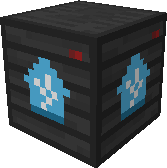
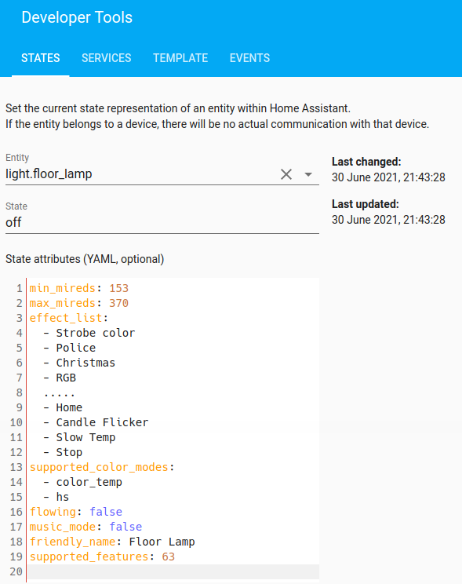
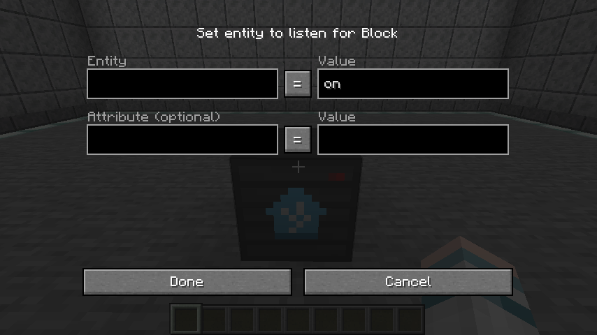

# State Block

The state block is an output redstone block. It emits a redstone signal when certain conditions of a specified entity is met. The attributes of the entity can even be tracked. It is only obtainable in creative mode.

### Examples
- Room temperature is below 27 degrees Celsius. 
- The seat sensor is occupied.
- The ceiling light has been turned on.
- Smart speaker is playing something.
- The smart bulb brightness is above 70%.

## Retrieving entity info

Before getting started, it's best to know what entity and attributes you are planning to listen to. The best way to retrieve data for entities is in the states tab in the Developer Tools of the Home Assistant Frontend. Here, we can retrieve the `state` of the entity, along with the supported `attributes` and their respective values.

## GUI configuration

Minimally, only the entity (top left) and value (top right) inputs are required. By default, the value input (top right) is set to `on`. The attribute (bottom left) and value (bottom right) inputs are optional and can be left empty. The operators in the middle can be toggled to either `=`, `>` or `<`. The operators can only be set to `<` and `>` when the values on the right side are numbers (5, -5, 5.0, 5.333).

## On/off states

This example demonstrates how to configure a state block to output a redstone signal **when the floor lamp `light.floor_lamp` is switched on.** As many entities only have `on` and `off` states, this will satisfy most use cases.

<video width="100%" controls>
  <source src="./assets/videos/state_block_example01.mp4" type="video/mp4">
  Your browser does not support the video tag.
</video> 

The value input (top right) can be changed from `on` to `off` to invert the redstone signal. Note the texture of the state block slightly changes depending on whether a redstone signal is outputted. 

## String states

This example demonstrates how to configure a state block to output a redstone signal **when the phone `sensor phone_ringer_mode` is set to normal mode.** Some entities use words for entity states, so the state block needs to listen to the same word the entity state will be in.

<video width="100%" controls>
  <source src="./assets/videos/state_block_example02.mp4" type="video/mp4">
  Your browser does not support the video tag.
</video> 

## Numerical states
This example demonstrates how to configure a state block to output a redstone signal **when the room temperature is below 27.4 degrees.** Besides `on` and `off` states, many other entities make use of numbers as entity states. As stated, when the value inputs are numbers, the operators `<` and `>` can also be used as a condition.

<video width="100%" controls>
  <source src="./assets/videos/state_block_example03.mp4" type="video/mp4">
  Your browser does not support the video tag.
</video> 

## Using attributes

This example demonstrates how to configure a state block to output a redstone signal **when the floor lamp `light.floor_lamp` is switched on with brightness of more than 50%.** In addition to entity states, the state block can also listen for entity attributes.

<video width="100%" controls>
  <source src="./assets/videos/state_block_example04.mp4" type="video/mp4">
  Your browser does not support the video tag.
</video> 

Note for the brightness attribute, the range is from` 0 - 255` where `128` is 50% brightness and `255` is 100% brightness.